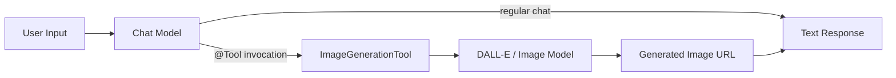

# Add Image Generation via LangChain4j Tools

## Overview

Add LangChain4j tool-based routing so the chat model automatically detects image generation requests and delegates them to a dedicated image model (DALL-E).

## Architecture Overview



The chat model analyzes user intent and automatically invokes the `@Tool`-annotated method when it detects image generation requests.

## Tasks

- [ ] Create ImageGenerationTool class with @Tool annotation
- [ ] Add createImageModel method to ModelFactory
- [ ] Add image model API key configuration to ModelsConfig
- [ ] Wire tool into ChatApplication's AiServices builder

## Files to Modify/Create

### 1. Create `ImageGenerationTool.java`

Path: `src/main/java/com/chatdemo/tools/ImageGenerationTool.java`

New tool class with `@Tool` annotation that wraps the image generation model:

```java
public class ImageGenerationTool {
    private final ImageModel imageModel;
    
    @Tool("Generate an image based on a text description. Use when user asks to create, draw, or generate images/pictures/illustrations.")
    public String generateImage(@P("The detailed description of the image to generate") String prompt) {
        Response<Image> response = imageModel.generate(prompt);
        return "Image generated: " + response.content().url();
    }
}
```

### 2. Update `ModelFactory.java`

Path: `src/main/java/com/chatdemo/ModelFactory.java`

Add method to create `OpenAiImageModel` for DALL-E:

```java
public static ImageModel createImageModel(String apiKey) {
    return OpenAiImageModel.builder()
        .apiKey(apiKey)
        .modelName("dall-e-3")
        .build();
}
```

### 3. Update `ModelsConfig.java`

Path: `src/main/java/com/chatdemo/config/ModelsConfig.java`

Add configuration for the image generation model (uses OpenAI API key).

### 4. Update `ChatApplication.java`

Path: `src/main/java/com/chatdemo/ChatApplication.java`

Key changes:

- Create `ImageGenerationTool` instance with the image model
- Register tool with `AiServices.builder(...).tools(imageGenerationTool)`
- Add `@SystemMessage` to guide the model on when to use the tool

Updated assistant builder:

```java
private Assistant createAssistant(ProviderConfig config) {
    ChatLanguageModel model = ModelFactory.createModel(config);
    ImageModel imageModel = ModelFactory.createImageModel(openaiApiKey);
    ImageGenerationTool imageTool = new ImageGenerationTool(imageModel);
    
    return AiServices.builder(Assistant.class)
        .chatLanguageModel(model)
        .chatMemoryProvider(memoryProvider)
        .tools(imageTool)  // Register the tool
        .build();
}
```

## No New Dependencies Required

The `langchain4j-open-ai` dependency already includes `OpenAiImageModel` for DALL-E support.

## How It Works

1. User sends: "Draw me a cat wearing a hat"
2. Chat model recognizes image generation intent
3. Model calls `generateImage(prompt)` tool automatically
4. Tool invokes DALL-E via `ImageModel`
5. Returns URL of generated image to user
